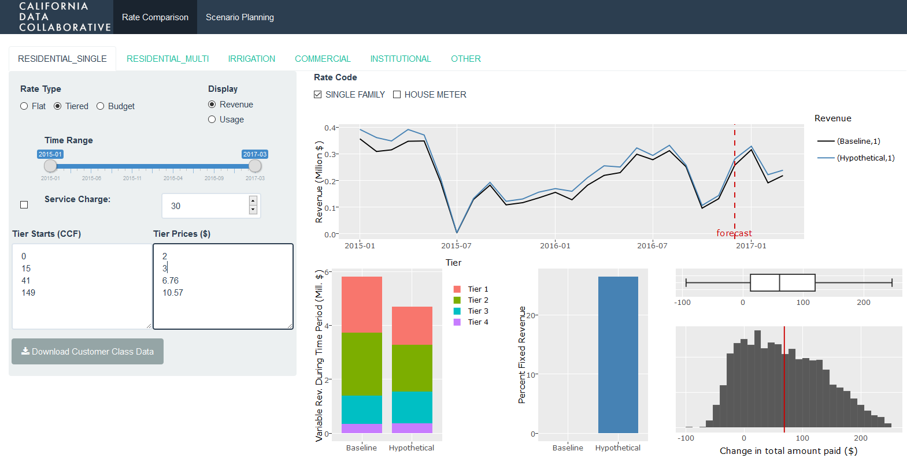

# Rate Comparison
An R-Shiny tool to easily understand and compare the revenue, equity, and demand implications of different water rate structures. 

This is an open project of the [California Data Collaborative](http://californiadatacollaborative.com/), developed in partnership with the [Moulton Niguel Water District](http://www.mnwd.com/) and [ARGO Labs](http://www.argolabs.org/).

## In Action

A live demo of the tool is available [here](https://demo.californiadatacollaborative.com/smc/rate-tool/). This demo uses [public water use data](https://data.smgov.net/Public-Services/Water-Usage/4nnq-5vzx) from the City of Santa Monica.

## Getting Started

It's easy to get the tool running locally using [data](https://data.smgov.net/Public-Services/Water-Usage/4nnq-5vzx) from the City of Santa Monica*, 

1. Ensure that `R` is [installed](https://www.r-project.org/).

2. Install any `R` package dependencies.

3. Clone this repository.

4. Copy the three files in the `smc_example` directory into the `data` directory.

4. Run the Shiny app, either [from the command line](http://shiny.rstudio.com/articles/running.html) or using the "Run App" button from within RStudio.

\**The data provided in this github has been modified by dropping unneeded columns and by renaming others.*

## How to contribute

Please see the [issues page](https://github.com/California-Data-Collaborative/rate-comparison/issues) for ideas or reach out to find out more.
